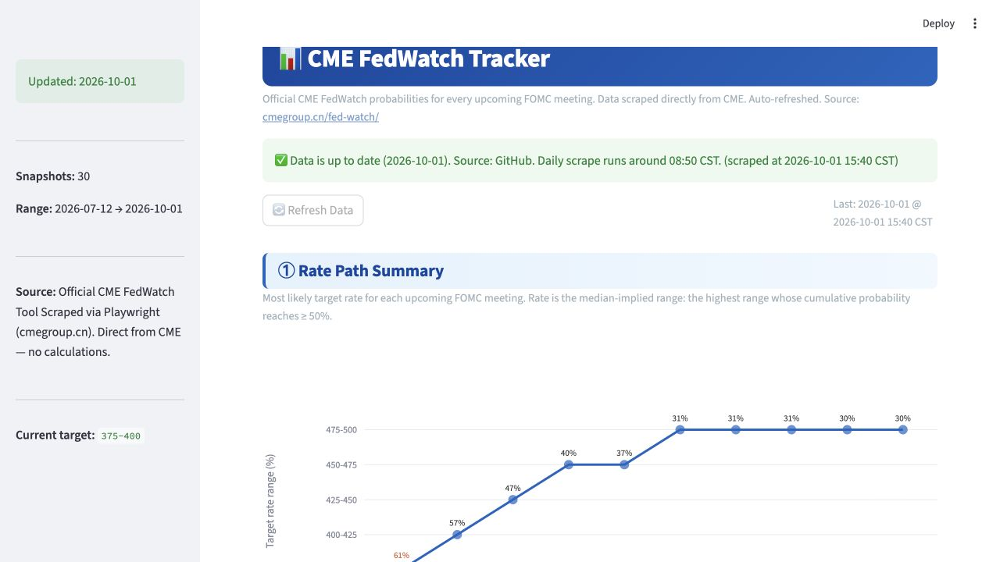

# CME FedWatch Tracker

<p align="center">
  <strong>Track how the market is pricing the next Federal Reserve rate decisions.</strong>
</p>

<p align="center">
  <a href="https://zuowood1234-cme-fedwatch-tracker.streamlit.app">Open the live dashboard</a>
  ·
  <a href="https://www.cmegroup.cn/fed-watch/">CME data source</a>
</p>

<p align="center">
  <a href="LICENSE"></a>
  <a href="https://zuowood1234-cme-fedwatch-tracker.streamlit.app"></a>
  
</p>



An open-source dashboard that archives official CME FedWatch probabilities and makes changes in the expected US interest-rate path easier to see. Data is collected each morning, stored as dated snapshots, and summarized through charts, tables, and change alerts.

> **Update schedule:** Cloudflare triggers the data workflow every day at **08:50 China Standard Time (00:50 UTC)**. GitHub Actions performs the browser-based scrape, saves the result, and sends a ServerChan notification.

## What you can see

| Panel | What it answers |
|---|---|
| **Rate Path Summary** | What target-rate range is most likely at each upcoming FOMC meeting? |
| **Current Probability Distribution** | How is probability distributed across every rate range and meeting? |
| **Probability Evolution** | How did the current distribution change versus 1 day, 1 week, and 1 month ago? |
| **Change Alerts** | Which probabilities moved by at least 5 percentage points? |

The current target range is highlighted throughout the dashboard. Tables can be searched, viewed full screen, and downloaded as CSV.

## How it works

```text
Cloudflare Worker cron (daily at 00:50 UTC / 08:50 CST)
                  |
                  | repository_dispatch
                  v
          GitHub Actions workflow
                  |
                  | Playwright + Chromium + xvfb
                  v
       Official CME FedWatch page
                  |
          +-------+------------------+
          |                          |
          v                          v
 data/daily/YYYY-MM-DD.json   ServerChan notification
 data/fedwatch_history.csv
          |
          v
     Streamlit dashboard
```

- **Source:** [Official CME FedWatch Tool](https://www.cmegroup.cn/fed-watch/)
- **Scheduler:** Cloudflare Workers Cron Triggers
- **Scraper:** Playwright with Chromium on GitHub Actions
- **Storage:** Versioned JSON and CSV files in this repository
- **Dashboard:** Streamlit Community Cloud

Cloudflare only starts the workflow. The actual QuikStrike page is rendered and scraped in GitHub Actions because it requires a full browser environment.

## Run locally

```bash
git clone https://github.com/zuowood1234/cme-fedwatch-tracker.git
cd cme-fedwatch-tracker
pip install -r requirements.txt
playwright install chromium

# Fetch the latest CME data
python scraper.py

# Start the dashboard
streamlit run app.py
```

The repository already contains historical snapshots, so the dashboard can be opened locally without running a new scrape first.

## Deployment

### Streamlit dashboard

1. Fork this repository.
2. Create a Streamlit Community Cloud app with branch `main` and entry point `app.py`.
3. If you want the dashboard's manual refresh button to write data back to GitHub, add these Streamlit secrets:

```toml
GITHUB_TOKEN = "your_fine_grained_token"
GITHUB_USERNAME = "your_github_username"
```

Use a fine-grained token limited to the selected repository with **Contents: Read and write**. The scheduled workflow does not depend on the Streamlit app being awake.

### Daily Cloudflare trigger

The Worker configuration lives in [`cloudflare/`](cloudflare/). Its cron schedule is `00:50 UTC`, which is always `08:50` in China.

Required Worker secret:

```text
GITHUB_TOKEN
```

The token needs permission to trigger Actions for this repository. Deployment and test instructions are in [`cloudflare/README.md`](cloudflare/README.md).

### ServerChan notification

Add `SERVERCHAN_SENDKEY` as a GitHub Actions repository secret. After a successful scrape, the workflow sends the daily summary through ServerChan.

## Project structure

| Path | Purpose |
|---|---|
| `app.py` | Streamlit dashboard and optional manual refresh |
| `scraper.py` | Playwright scraper for CME's QuikStrike component |
| `serverchan.py` | Builds and sends the daily ServerChan summary |
| `.github/workflows/daily-update.yml` | Scrape, commit, and notification workflow |
| `cloudflare/` | Worker that dispatches the workflow at 08:50 CST |
| `data/daily/` | Full dated JSON snapshots |
| `data/fedwatch_history.csv` | Long-format history used by the dashboard |

## Data notes

- CME's Chinese FedWatch page uses the same QuikStrike data component as the English site.
- The scraper records CME's published probabilities; it does not calculate or estimate them independently.
- Each daily snapshot includes current, 1-day, 1-week, and 1-month comparison values when CME provides them.
- This project is unofficial and provided for informational purposes only. It is not financial advice.

## License

[MIT](LICENSE)

## Acknowledgements

- Data: [CME FedWatch Tool](https://www.cmegroup.cn/fed-watch/)
- Dashboard: [Streamlit](https://streamlit.io)
- Browser automation: [Playwright](https://playwright.dev)
- Scheduling: [Cloudflare Workers](https://workers.cloudflare.com/)
